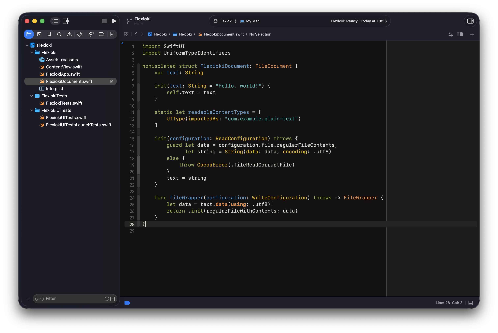
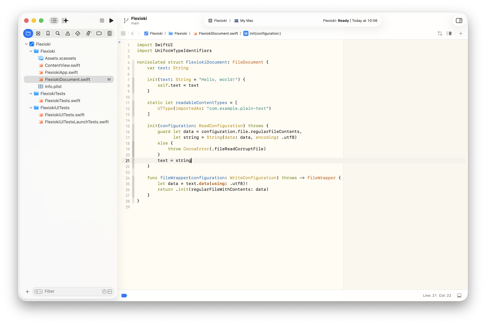

# Flexoki for Xcode

Xcode themes based on [Flexoki](https://stephango.com/flexoki), the inky color system created by [Steph Ango](https://github.com/kepano).

This directory includes the Xcode port with:

- `Flexoki Dark.xccolortheme`
- `Flexoki Light.xccolortheme`

## Screenshots

| Flexoki Dark | Flexoki Light |
| --- | --- |
|  |  |

## Installation

1. Clone or download this repository, then open the `xcode/` directory.
2. Create Xcode's themes directory if it does not exist:

```bash
mkdir -p ~/Library/Developer/Xcode/UserData/FontAndColorThemes
```

3. Copy the theme files into Xcode's theme folder:

```bash
cp "Flexoki Dark.xccolortheme" ~/Library/Developer/Xcode/UserData/FontAndColorThemes/
cp "Flexoki Light.xccolortheme" ~/Library/Developer/Xcode/UserData/FontAndColorThemes/
```

4. Restart Xcode.
5. Open `Xcode > Settings > Themes` and select `Flexoki Dark` or `Flexoki Light`.

Older Xcode releases use `Xcode > Preferences > Themes`.

## Notes

- The light and dark themes keep Flexoki's published palette values.
- A few Xcode-only syntax keys missing from the upstream export are filled in here so recent Xcode releases can color every built-in token category consistently.
- After selecting the theme, you can still change the editor font and size from Xcode's theme editor.
